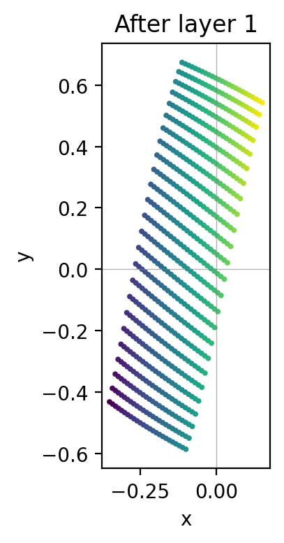
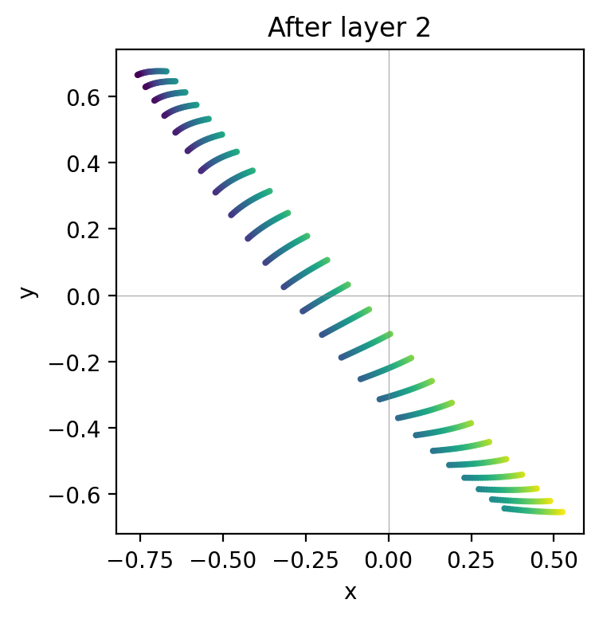
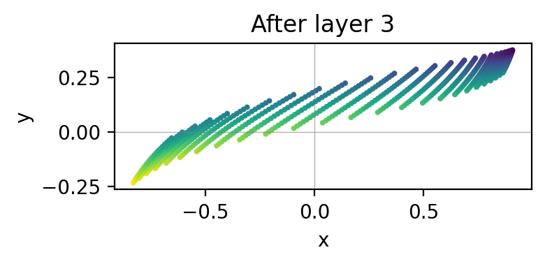
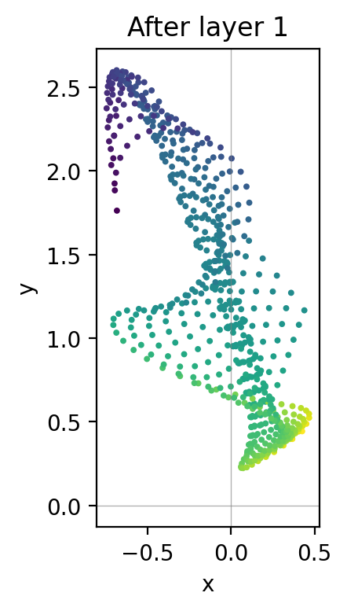
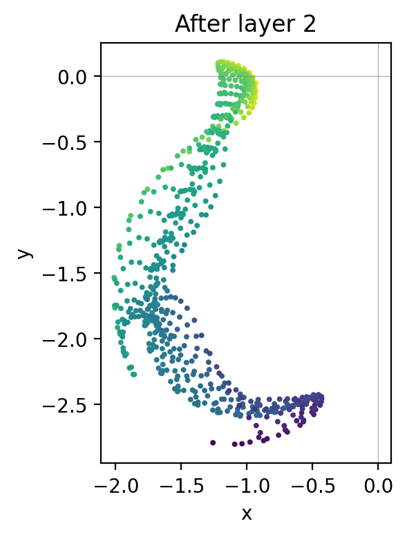
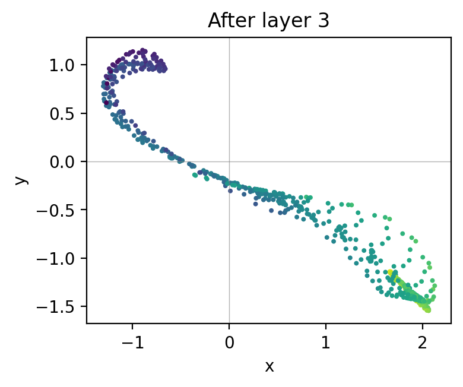

# visualizing-neural-mappings

ニューラルネットワークや深層ガウス過程（DGP）が、2 次元入力空間をどう歪めるかを**視覚的に体感するための実験リポジトリ**です。  
各層が入力平面をどのようにねじったり引き伸ばしたりするかを、色付きグリッドを追跡することで理解します。

## できること

- 入力グリッドを各層に通し、**層ごとの写像結果をPNGとして保存**
- ランダム MLP 版と、RBF カーネルを用いた DGP 版の両方を比較
- 色の対応関係から、どの領域がどこへ移動したかを直感的に把握

### サンプル出力と読み取り方

- MLP 版（tanh, 層3）:  
  
  
  
    
  - グリッドが折り曲がり、局所的に引き伸ばされていく様子が見られます。
- DGP 版（lengthscale=1.0, 層3）:  
  
  
  
    
  - 滑らかな RBF カーネルでも、層を重ねると領域がねじれたり分断されたりすることが分かります。

## 動かし方

### 1. 必要環境

- pyenv 前提
- 依存パッケージをインストール: `pip install -r requirements.txt`
- 仮想環境の利用を推奨: `python -m venv .venv && source .venv/bin/activate`

### 2. コードの実行

#### ランダム MLP 版（`visualize_mapping.py`）

2 次元 → 2 次元の線形写像と活性化関数を複数層積み重ね、各層の出力を `outputs/` に保存

```bash
python visualize_mapping.py
```

#### 深層ガウス過程版（`visualize_dgp_mapping.py`）

RBF カーネルで GP をサンプルし、層として重ねます。各層の出力を `outputs_dgp/` に保存

```bash
python visualize_dgp_mapping.py
```

### 3. 何が分かるか

- **空間の歪み方**: 局所的な引き伸ばし、折り曲がり、領域の分断。
- **深さの影響**: 層を重ねるほど複雑な写像になる様子。
- **モデルの違い**: MLP の非線形性 vs. RBF カーネルを持つ DGP の滑らかさ。
- **学習前の直感**: パラメータがランダムでも、ネットワークはすでに非自明な関数を定義している。
